::: {.stats-grid-container}
::: {.stats-grid}

::: {.grid-item}

311.0
Kilometer
:::

::: {.grid-item}

1713
Höhenmeter
:::

::: {.grid-item}

12h 8min
Fahrzeit
:::

::: {.grid-item}

25.6
km/h (55.2 max.)
:::

::: {.grid-item}

96.6
Watt (365 max.)
:::

::: {.grid-item}

123.8
bpm (174.0 max.)
:::

:::
:::

&nbsp;

### Die "beste Tour unseres Lebens": 300-Kilometer-Premiere

Unsere allererste Mecklenburger Seenrunde – und gleichzeitig unsere allerersten 300 Kilometer im Sattel überhaupt. 
In einem Wechselbad aus großer Ehrfurcht und prickelnder Vorfreude nagten die Fragen: Schaffen wir das? Halten wir durch? 
Die Antwort lautet: Jawohl! Und es war ein riesiger Spaß.

Nach einer sehr kurzen, aber stilechten Nacht im Wohnwagen-Exil fiel kurz vor sechs Uhr morgens in Neubrandenburg 
endlich der Startschuss zur "besten Tour unseres Lebens", wie man in MSR-Kreisen zu sagen pflegt.
Uns erwartete ein perfekt durchorganisiertes Event, echte Gänsehaut-Stimmung auf und neben der Strecke sowie 
ein Buffet-Marathon an den Versorgungsstationen, der nur noch von der Herzlichkeit der vielen fleißigen 
Helfer:innen übertroffen wurde. 

Zugegeben: Ja, es war fordernd. Ja, es gab Momente kurz vor der Verzweiflung, in denen der Tritt schwer wurde, 
die Muskeln brannten und die mentale Stärke leicht zu bröckeln begann. 
Aber wir sind über uns hinausgewachsen, haben die Zähne zusammengebissen und uns gegenseitig gezogen. 
Nach über 300 Kilometern sind wir Hand in Hand ins Ziel gerollt. Eine unvergessliche Erfahrung, die für immer bleibt. 
Und eines ist sicher: 2024 stehen wir wieder am Start!

&nbsp;

  <canvas id="elevationChart"></canvas>

::: {.gallery}

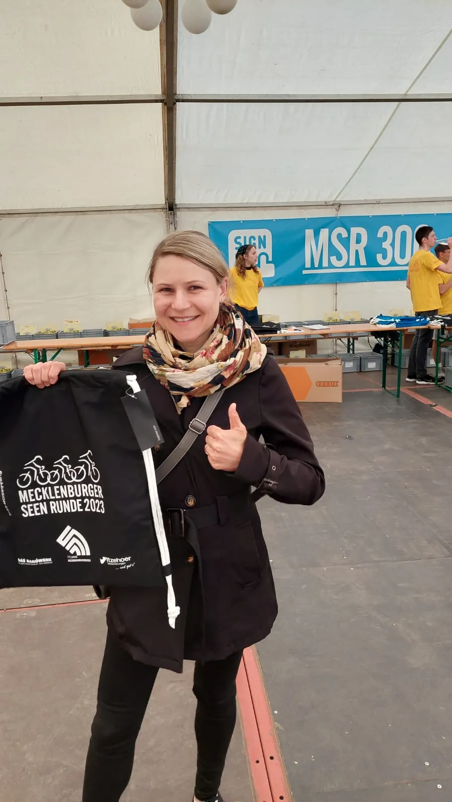{group="tour"}

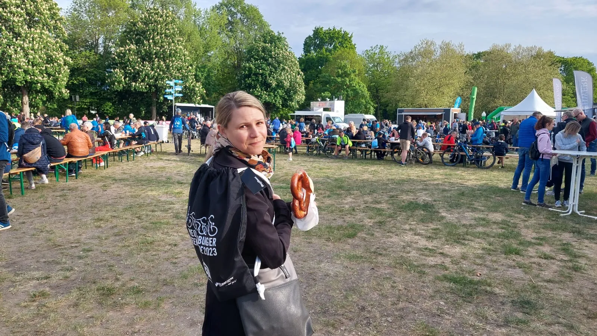{group="tour"}

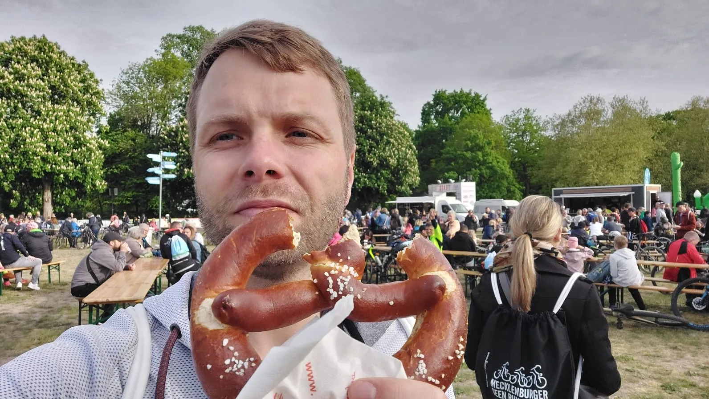{group="tour"}

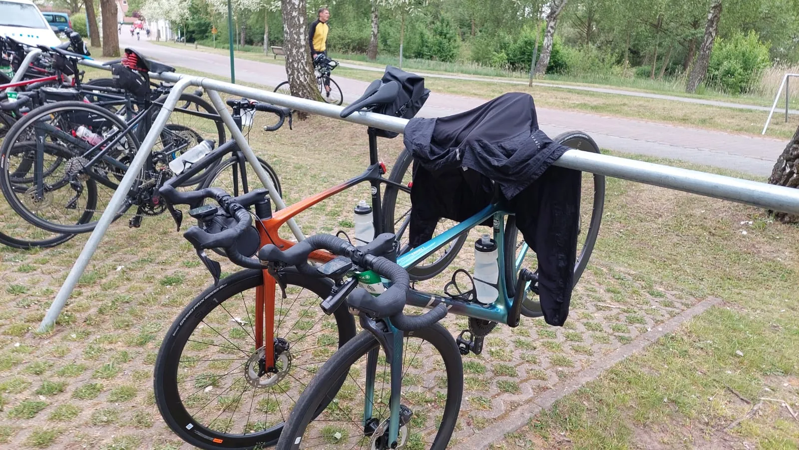{group="tour"}

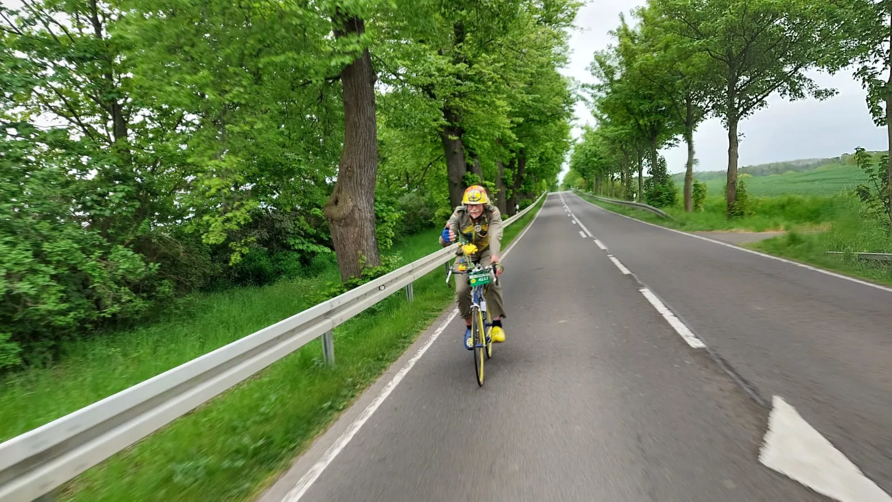{group="tour"}

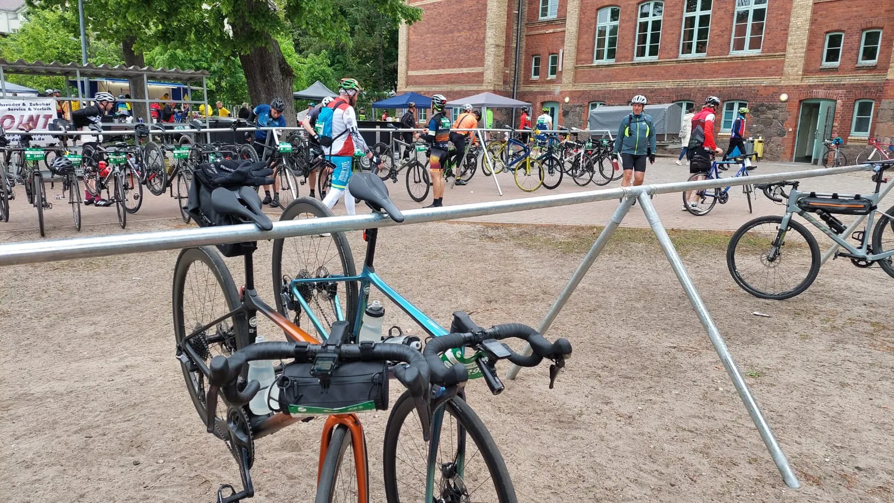{group="tour"}

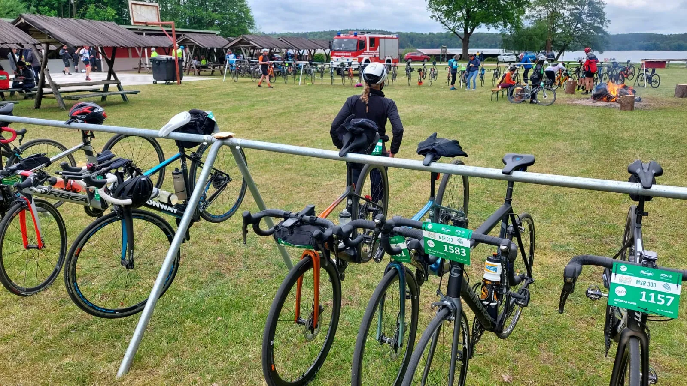{group="tour"}

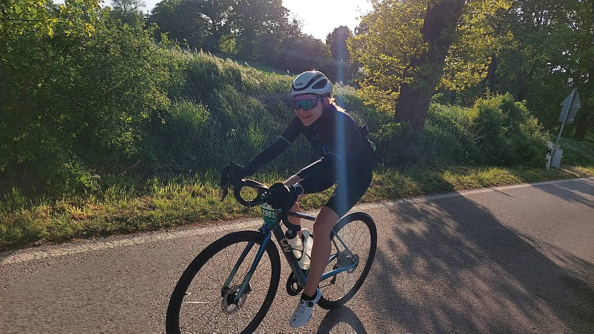{group="tour"}

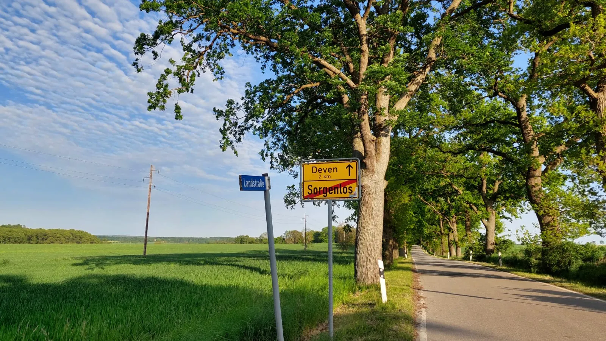{group="tour"}

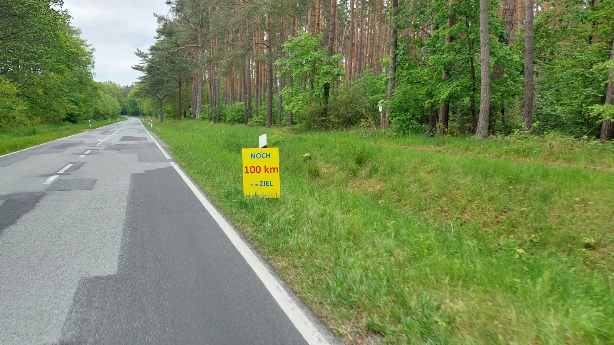{group="tour"}

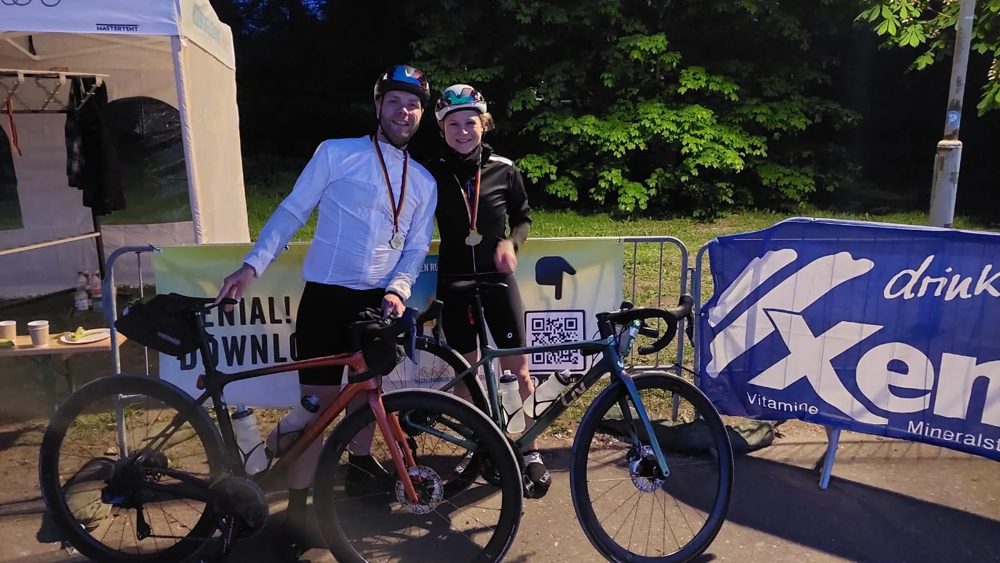{group="tour"}

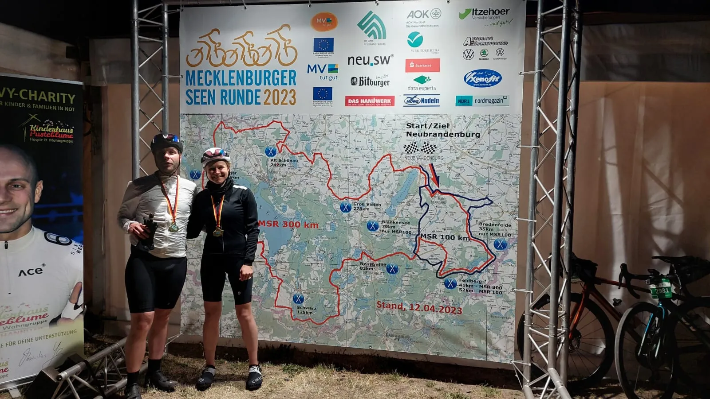{group="tour"}

:::

&nbsp;

::: {.trip-dashboard}

### Mecklenburger Seenrunde: Stand aktuell

311

Kilometer

1713

Höhenmeter

12h 8min

Fahrzeit

:::

