::: {.stats-grid-container}
::: {.stats-grid}

::: {.grid-item}

305.4
Kilometer
:::

::: {.grid-item}

1590
Höhenmeter
:::

::: {.grid-item}

10h 11min
Fahrzeit
:::

::: {.grid-item}

30.0
km/h (63.0 max.)
:::

::: {.grid-item}

101.2
Watt (381 max.)
:::

::: {.grid-item}

124.0
bpm (169.0 max.)
:::

:::
:::

&nbsp;

Unsere MSR 300 2026 – die nunmehr vierte!

Die Mecklenburger Seen Runde gehört inzwischen fest zu unserem
Frühsommer-Repertoire.

Dieses Jahr begann alles mit einem sorgenvollen Blick auf den Wetterbericht.
Denn der stimmte wenig optimistisch: kühle Temperaturen, Wind... und auch
noch Regen! Die ersten Starter:innen wurden tatsächlich nachts auf nassen
Straßen losgejagt. Wir rollten um 4:40 Uhr über die Start-/Ziellinie –
und prompt hörte der Regen auf. Wir blieben den gesamten Tag trocken.
Manchmal muss man auch einfach Glück haben.

Allerdings bedeutete „trocken“ keineswegs „einfach“. Während uns die Sonne
im vergangenen Jahr fast schon verwöhnte, präsentierte sich die MSR diesmal
deutlich frischer und vor allem windiger: Rund 190 km lang stemmten wir uns
gegen kräftige Böen, die uns immer wieder daran erinnerten, dass Gegenwind
eigentlich nur eine höfliche Umschreibung für einen „unsichtbaren Berg“ ist.

Zum Glück gehört zur MSR eine der schönsten Traditionen des
Langstreckenradelns: Gemeinschaft. Immer wieder fanden sich starke Gruppen
zusammen, in denen sich die Arbeit teilen ließ. Mal vorne, mal hinten,
mal irgendwo dazwischen – mit vereinten Kräften rollt es einfach besser.
Wer schon einmal mit 35 bis 40 km/h im perfekten Windschatten den Asphalt
entlanggedonnert ist, weiß: Das fühlt sich fast ein bisschen nach Mogeln an.

Überhaupt scheint die Veranstaltung von Jahr zu Jahr leichter zu werden.
Natürlich sind 300 Kilometer immer noch 300 Kilometer. Natürlich melden
sich irgendwann Beine, Rücken, Hände und andere Körperteile.
Aber die Strecke verliert ihren Schrecken. Die Abläufe werden Routine.
Die Depots kommen gefühlt immer schneller. Vielleicht liegt es an der
Erfahrung, vielleicht auch ein klein bisschen am Training. 
Oder einfach daran, dass wir in diesem Jahr absolut pannen- und 
defektfrei durchgekommen sind. Insbesondere Fabi freute sich darüber, 
dieses Mal mit vollgeladener Schaltung auf alle seine Gänge 
zurückgreifen zu können.

Wie gewohnt war die Organisation überragend. Freundliche Helfer:innen,
bestens ausgestattete Depots, hervorragende Verpflegung und diese
unverwechselbare Atmosphäre, die die MSR so besonders macht. Kein
verbissener Wettkampf, sondern tausende Menschen, die gemeinsam ihr
persönliches sportliches Wunder vollbringen wollen.

Ein kleiner Zwischenfall wartete dann allerdings kurz vor dem Ziel.
Wer die Strecke kennt, weiß, welche Brücke im Jahn-Sportpark kurz vor der
großen Festwiese wir meinen: kurz, steil und genau dann platziert, wenn
die Beine ohnehin längst andere Pläne haben. Sophies unmittelbarer Vordermann 
war von dieser letzten Herausforderung offenbar etwas überrascht. 
Das Herunterschalten wurde wohl schlicht vergessen, die
Geschwindigkeit verschwand schlagartig und damit unweigerlich die komplette
Fahrstabilität. Während der Sportler sich spektakulär Richtung Stillstand
verabschiedete, räumte er Sophie gleich mit ab. Glücklicherweise konnte sie
sich noch rechtzeitig ausklicken und abfangen. Alles heil geblieben.
Nur das Ego des gestürzten Fahrers dürfte noch einige Zeit
Reparaturbedarf haben.

Die letzten Meter gehörten dann wieder uns. Hand in Hand rollten wir über
die Ziellinie, stolz, glücklich und ein kleines bisschen erstaunt darüber,
wie selbstverständlich sich 300 Kilometer inzwischen anfühlen.

Natürlich durfte auch die legendäre Siegerbrezel nicht fehlen. Und genau dort, 
mit noch warmer Brezel aus dem Steinofen in der Hand und Medaille um den Hals, 
entstand ein gefährlicher Gedanke: Wenn die MSR jedes Jahr ein bisschen einfacher
wird – brauchen wir für 2027 etwa eine „erweiterte“ Herausforderung?

Wir werden sehen. Aber eines ist sicher: Die Seenplatte hat uns auch dieses
Jahr wieder begeistert. Und die Chancen stehen nicht schlecht (um nicht zu
sagen: 100 %), dass wir nächstes Jahr erneut am Start stehen.

&nbsp;

  <canvas id="elevationChart"></canvas>

::: {.gallery}

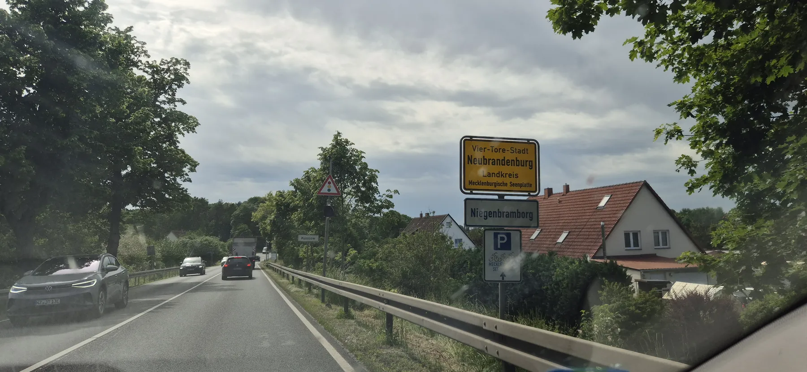{group="tour"}

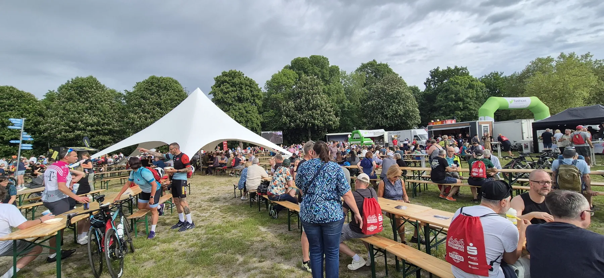{group="tour"}

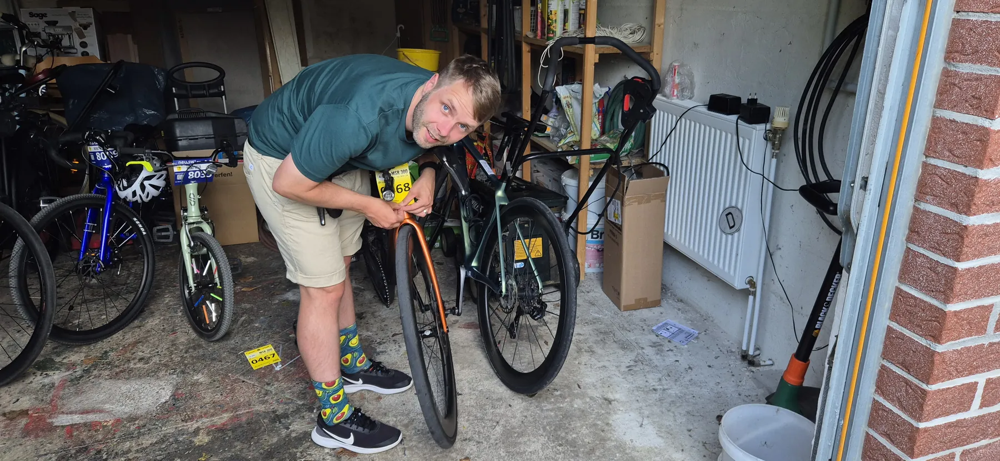{group="tour"}

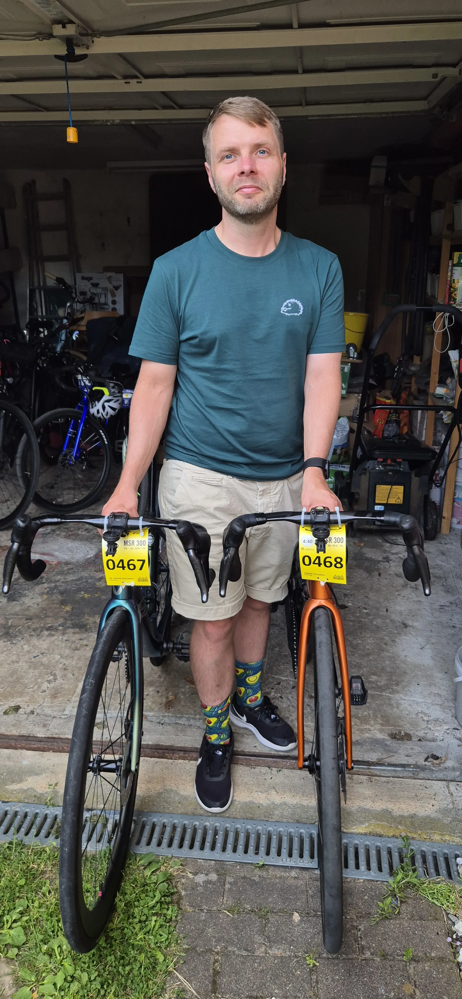{group="tour"}

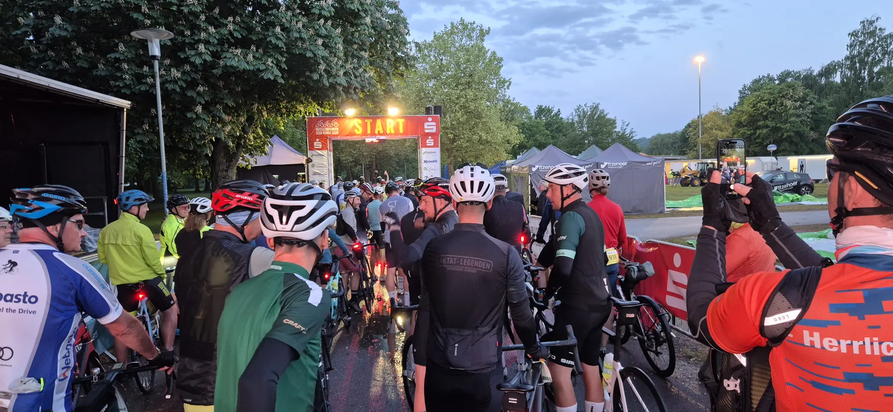{group="tour"}

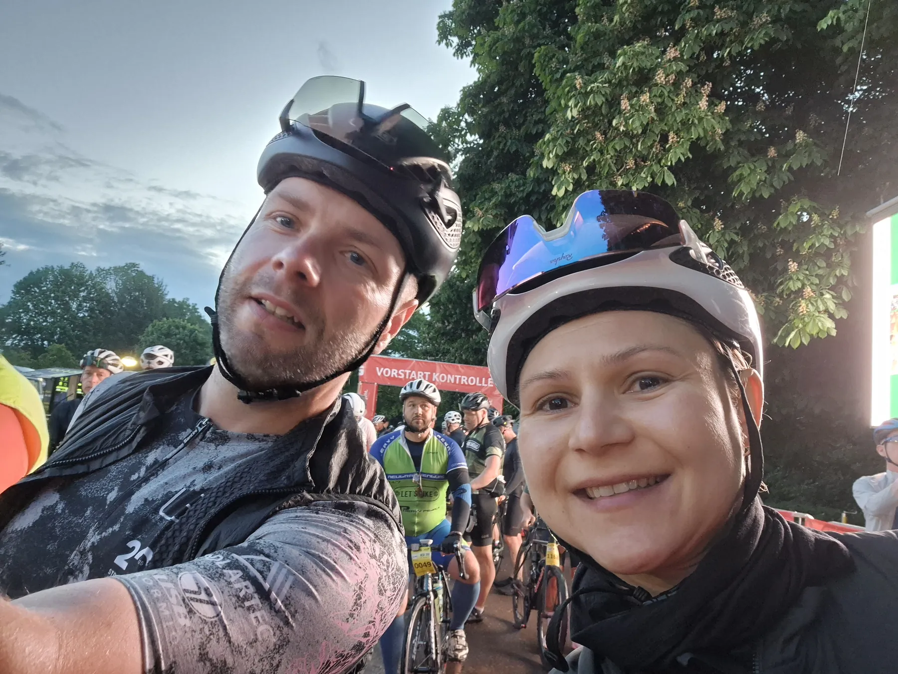{group="tour"}

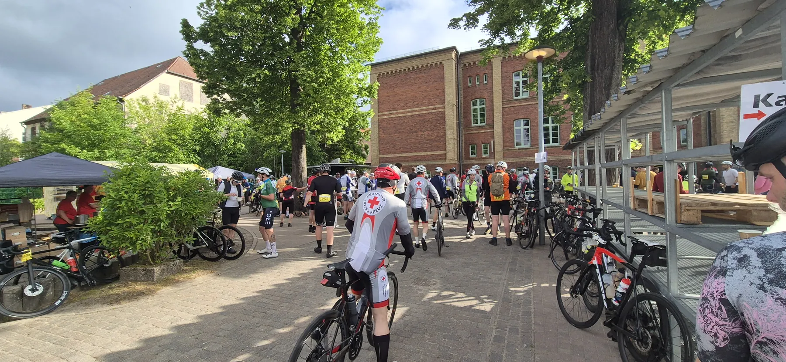{group="tour"}

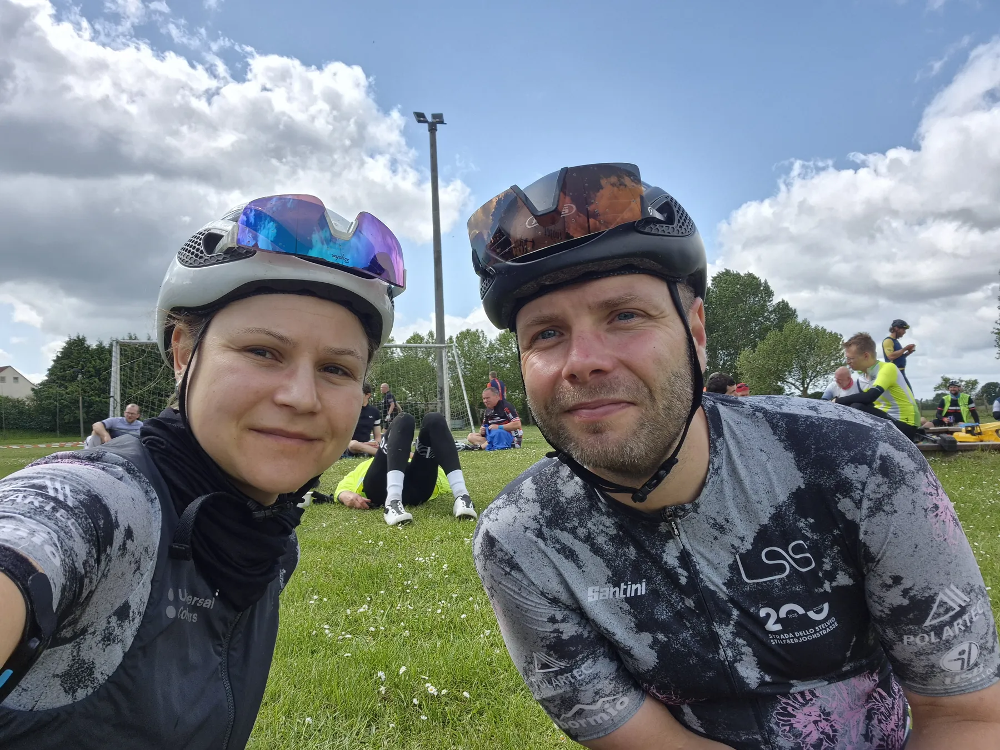{group="tour"}

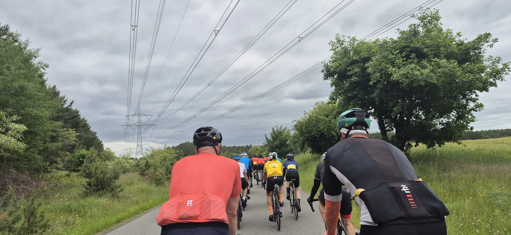{group="tour"}

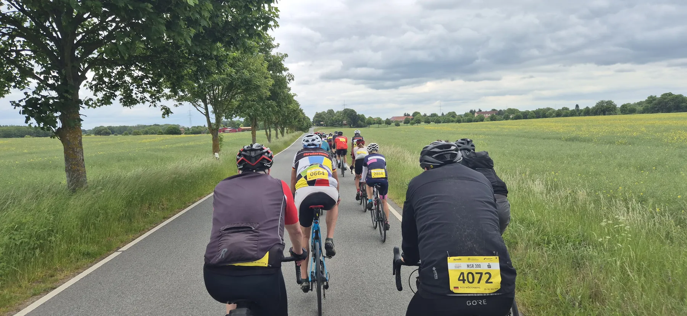{group="tour"}

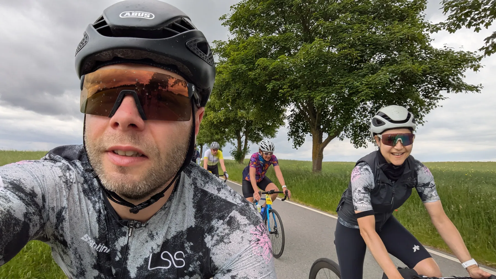{group="tour"}

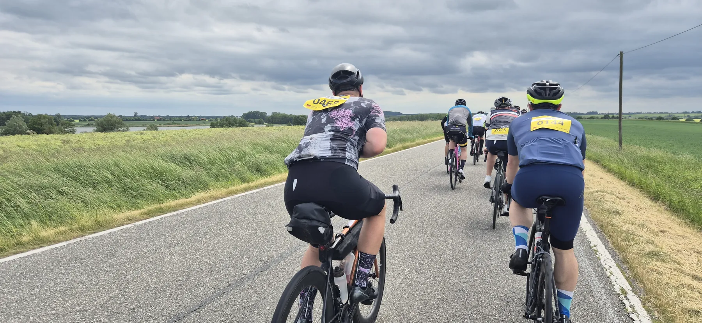{group="tour"}

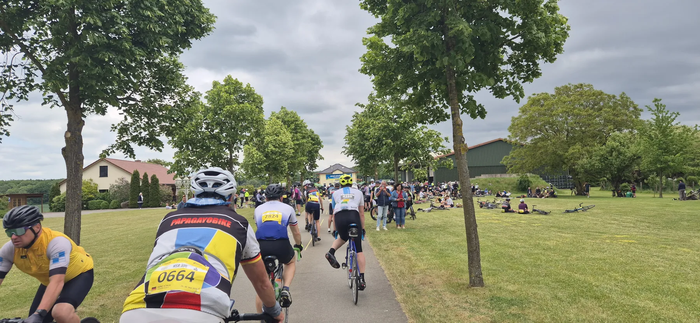{group="tour"}

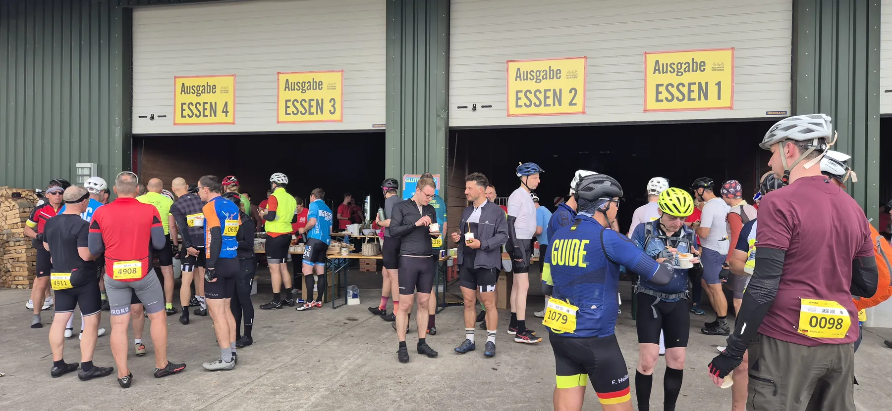{group="tour"}

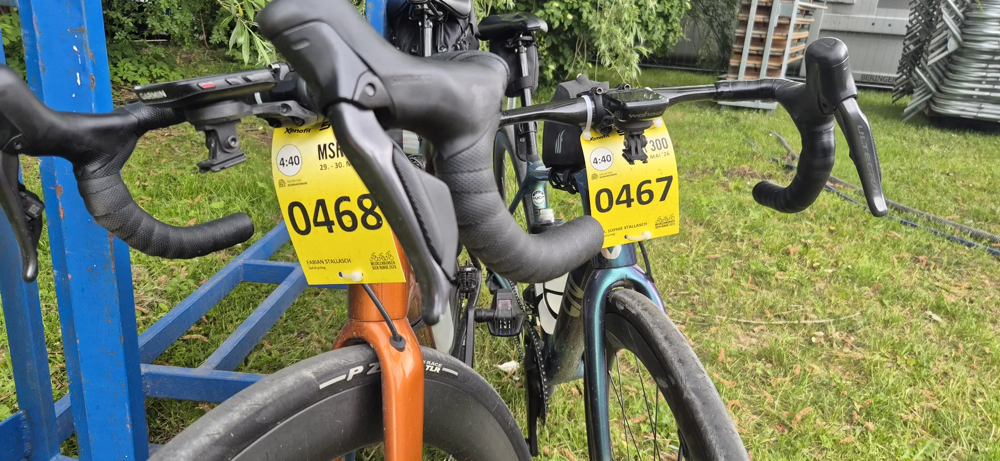{group="tour"}

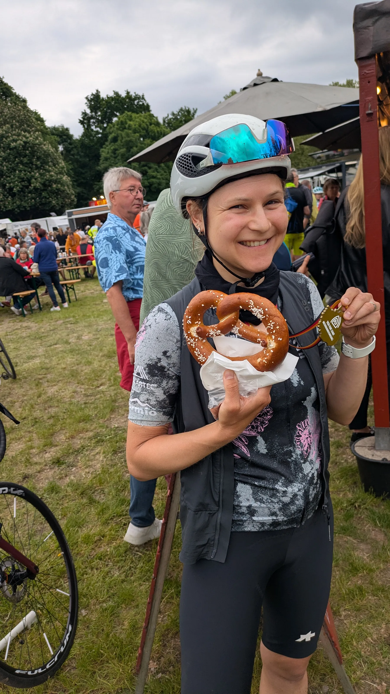{group="tour"}

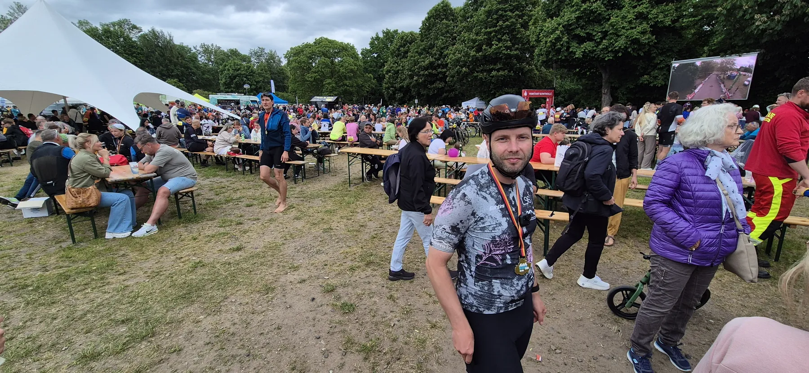{group="tour"}

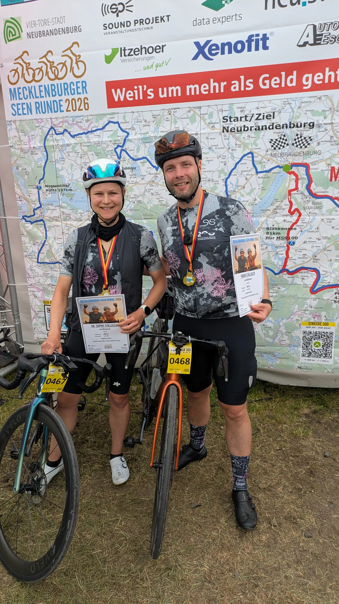{group="tour"}

:::

&nbsp;

::: {.trip-dashboard}

### Mecklenburger Seenrunde: Stand aktuell

1227

Kilometer

6590

Höhenmeter

42h 13min

Fahrzeit

:::

