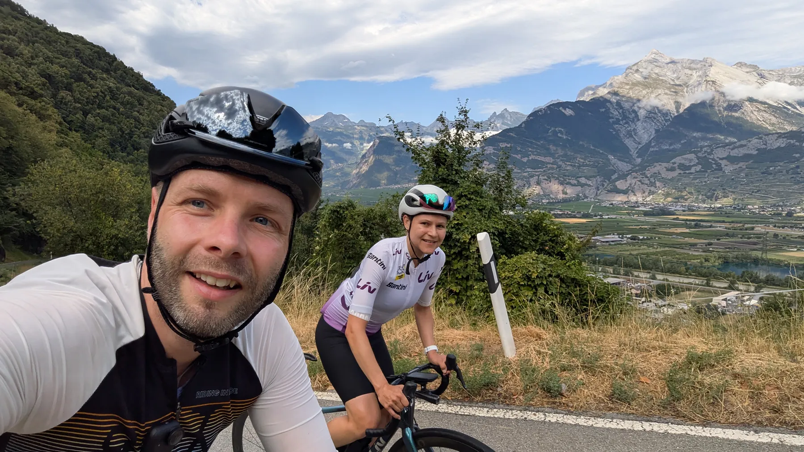
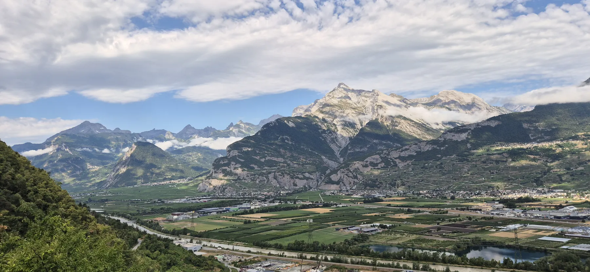
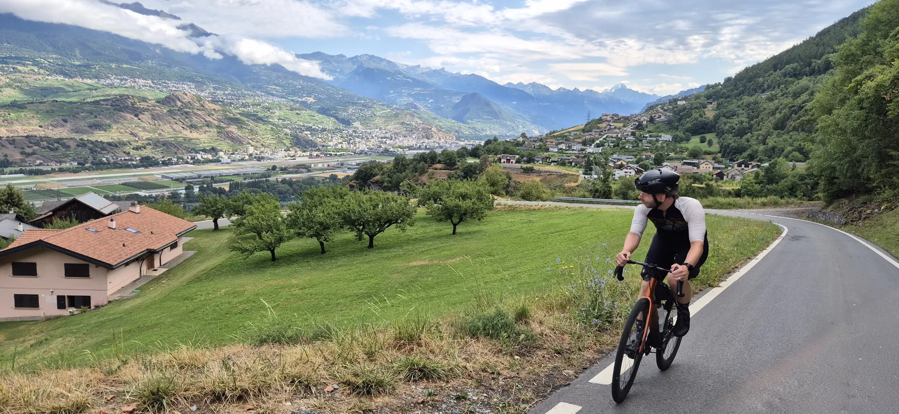
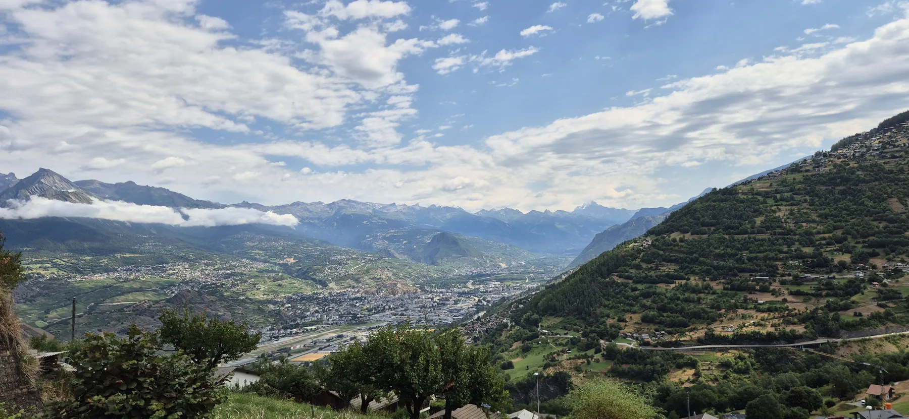
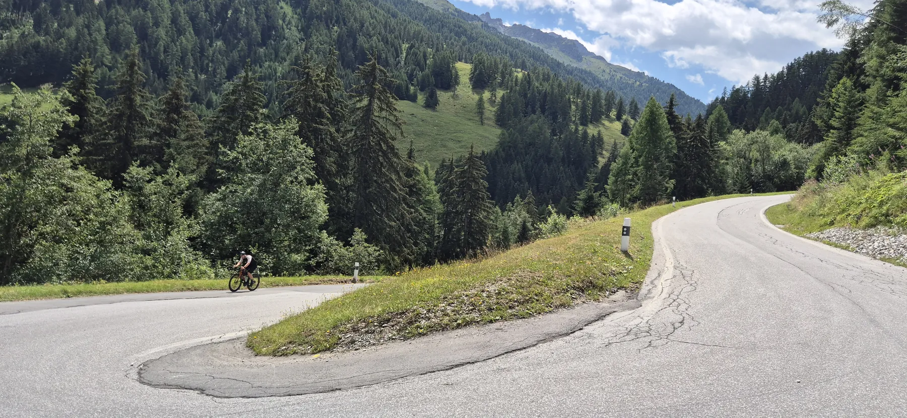
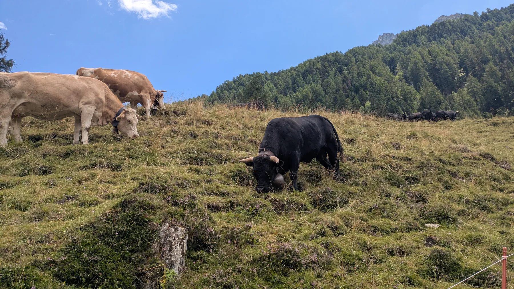
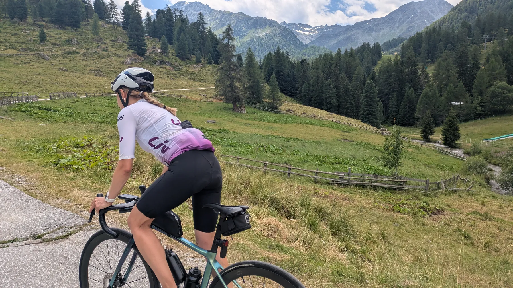
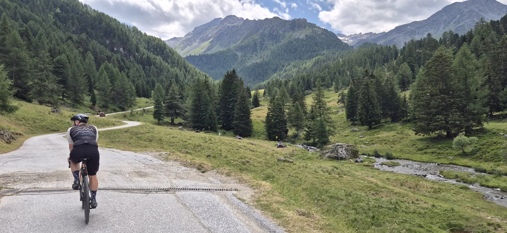
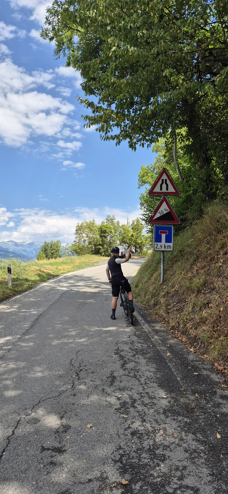

::: {.stats-grid-container}
::: {.stats-grid}

::: {.grid-item}

47.6
Kilometer
:::

::: {.grid-item}

1400
Höhenmeter
:::

::: {.grid-item}

2h 54min
Fahrzeit
:::

::: {.grid-item}

16.5
km/h (67.3 max.)
:::

::: {.grid-item}

98.1
Watt (394 max.)
:::

::: {.grid-item}

129.4
bpm (166.0 max.)
:::

:::
:::

&nbsp;

### (K)ein Ruhetag

Ganz entspannt sollte dieser Tag werden. Vormittags ein bisschen radeln, danach eine ausgiebige Siesta und am Nachmittag diverse Erledigungen tätigen und Vorbereitungen für die kommenden Tage treffen. Da liegt ein Ausflug ins Val de Nendaz doch nahe – dachten wir. Naiv, wie wir sind.

Das südliche Seitental wurde im Netz als „atemberaubend“ angepriesen. Also schossen wir beim Frühstück schnell die Routenplanung zusammen: „Ah ja, noch nicht einmal 50 Kilometer und sogar unter 1500 Höhenmeter.“ Passt für einen Ruhetag. Nehmen wir!

Deutlich cleverer wäre es allerdings gewesen, einmal ins Höhenprofil hineinzuzoomen. Nachdem wir die ersten Kilometer mit tatsächlich atemberaubenden Ausblicken auf das Rhonetal hinter uns gelassen hatten und auf einen einsamen kleinen Pfad aus Aproz in Richtung Basse-Nendaz abbogen, hätten wir spätestens stutzig werden müssen.

Denn: Nein, auch die Schweizer stellen keine Verkehrsschilder zum reinen Vergnügen auf. Auch kein Schild mit dem Hinweis: „Achtung, dieser Weg enthält Passagen mit 50 % Steigung.“ Sophie: „Oh. Ich hoffe, das ist ein Witz.“ Fabi: „Mh. Ich auch.“ Nein. Es war *kein* Witz. 

Wir glauben zwar immer noch nicht an die 50 %, aber über 30 % waren es teilweise definitiv. Traktion? Fehlanzeige. Das hat wirklich so gar keinen Spaß mehr gemacht. Der Schweiß lief dieses Mal primär aus Angst – nicht aus Anstrengung.

Als wir Nendaz erreichten, standen bereits über 500 Höhenmeter auf dem Tacho. Wir hofften, dass die verbleibenden 900 Höhenmeter die Freude und Motivation wieder zurückbringen würden. Leider war dem nicht so. Die restliche Strecke zog sich gefühlt bis ins Endlose, unsere Beinchen hatten nach dem ersten Teil kaum noch Kraft und die Umgebung war, naja, irgendwie auch nur so lala.

Wir sind ehrlich: Unterm Strich war das keine tolle Tour. Wir waren ziemlich froh, als wir wieder zurück waren. Die Siesta fiel natürlich ebenfalls flach, weil uns die Aktion deutlich mehr Zeit gekostet hatte als geplant.

Aber wir wissen ja: Auch solche Tage gehören zum Leben zweier verliebter Radler. Und sie halten uns natürlich nicht davon ab, morgen wieder auf den Bock zu springen und das nächste Abenteuer zu suchen.

&nbsp;

  <canvas id="elevationChart"></canvas>

::: {.gallery}

{group="tour"}

{group="tour"}

{group="tour"}

{group="tour"}

{group="tour"}

{group="tour"}

{group="tour"}

{group="tour"}

{group="tour"}

:::

&nbsp;

::: {.trip-dashboard}

### Sommerurlaub 2026: Stand aktuell

303

Kilometer

9831

Höhenmeter

19h 19min

Fahrzeit

:::
