::: {.stats-grid-container}
::: {.stats-grid}

::: {.grid-item}

95.7
Kilometer
:::

::: {.grid-item}

2637
Höhenmeter
:::

::: {.grid-item}

5h 24min
Fahrzeit
:::

::: {.grid-item}

17.7
km/h (96.7 max.)
:::

::: {.grid-item}

101.6
Watt (342 max.)
:::

::: {.grid-item}

129.8
bpm (174.0 max.)
:::

:::
:::

&nbsp;

### Kein Wiedersehen auf dem Grand Saint Bernard

Der Grand Saint Bernard gehört zum Pflichtprogramm der „quäldich“-Club-2K-Passjagd. Also mussten wir hin. Und ganz ehrlich: Wir hatten von Anfang an so ein bisschen das Gefühl, dass diese Beziehung schwierig werden könnte.

Der Anstieg von Martigny ist mit über 45 Kilometern und rund 2000 Höhenmetern nämlich nicht gerade ein kleiner Flirt. Dazu führt die Straße als riesige Hauptverkehrsader Richtung Italien und passiert obendrein eine ca. 6 Kilometer lange, enge und damit radlerunfreundliche Galerie, ohne Seitenstreifen. Wir hatten extra einen Sonntag ausgesucht, in der Hoffnung, dem ganz großen Verkehrschaos zu entgehen.

Nun ja. Sagen wir es so: mäßig erfolgreich. Die Autos ließen beim Überholen ungefähr so viel Abstand, wie wir heute gute Laune hatten. Unsere Stimmung wanderte jedenfalls ziemlich schnell in den Keller; Lautstärke und Stresspegel waren enorm. Bald hatten wir uns sogar untereinander so sehr in den Haaren, dass wir ca. 30 der 45 Kilometer totschwiegen. Romantik auf dem Rennrad...

Erst auf den letzten sechs Kilometern – und damit ungefähr den letzten 500 Höhenmetern – wurde es etwas ruhiger, weil die meisten Autos den Tunnel nutzen. Hier war es dann landschaftlich sogar richtig schön. Aber ganz ehrlich: Da war emotional schon zu viel kaputt.

Der Grand Saint Bernard ist jetzt abgehakt. Wir waren da. Wir haben ihn bezwungen. Wir haben uns kennengelernt. Aber es wird wohl kein Wiedersehen geben.

Für den Rückweg hatten wir uns dann noch den Col de Champex ausgesucht. 600 Höhenmeter extra, nur um nicht im Tal auf der großen Saint-Bernard-Straße gegen den Wind kämpfen zu müssen. Und siehe da: Der Col de Champex war ganz nach unserem Geschmack. Viele schöne Kehren, praktisch kein Verkehr und Vorfahrt für Postbusse. Dafür gibt es in der Schweiz übrigens sogar ein eigenes Verkehrsschild: ein gelbes Horn auf blauem Hintergrund. Der Col de Champex hat unseren Ausflug dann also doch noch ein bisschen gerettet.

Und so bleibt am Ende die Erkenntnis: Grand Saint Bernard – einmal und hoffentlich *nie* wieder. Col de Champex – einmal und hoffentlich *bald* wieder.

&nbsp;

  <canvas id="elevationChart"></canvas>

::: {.gallery}

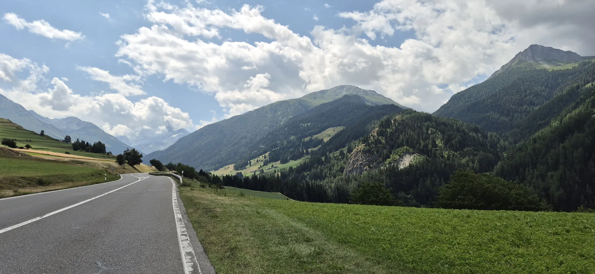{group="tour"}

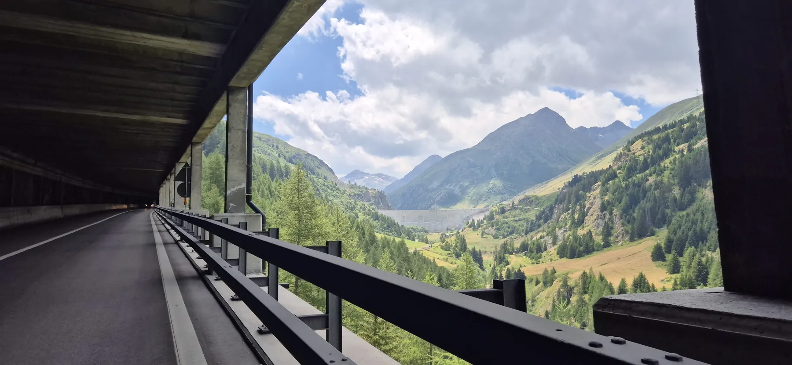{group="tour"}

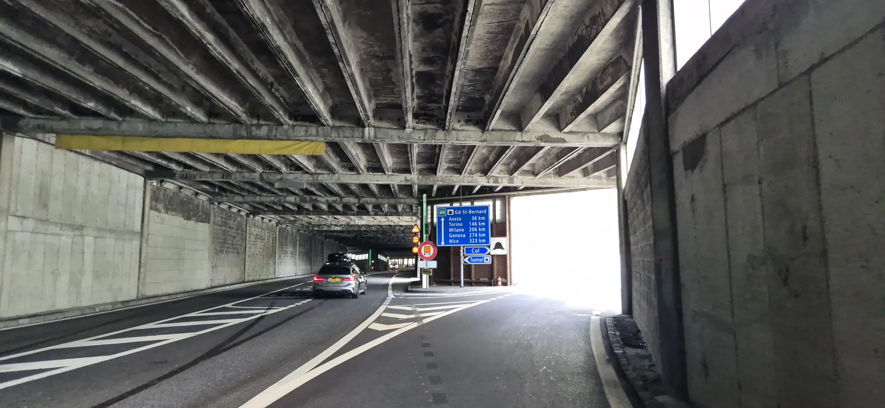{group="tour"}

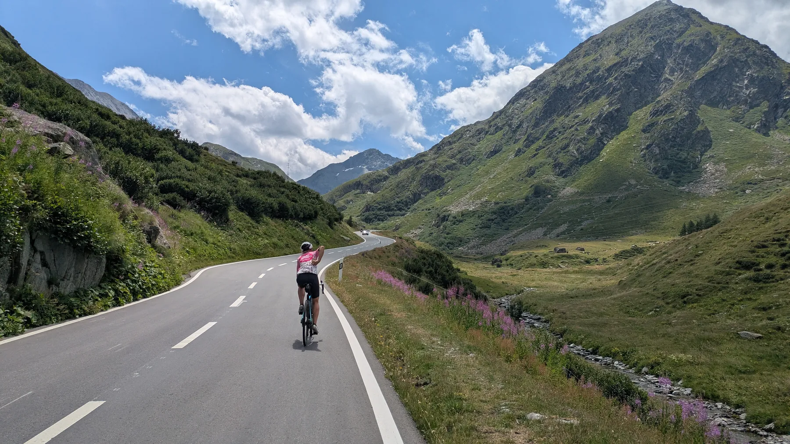{group="tour"}

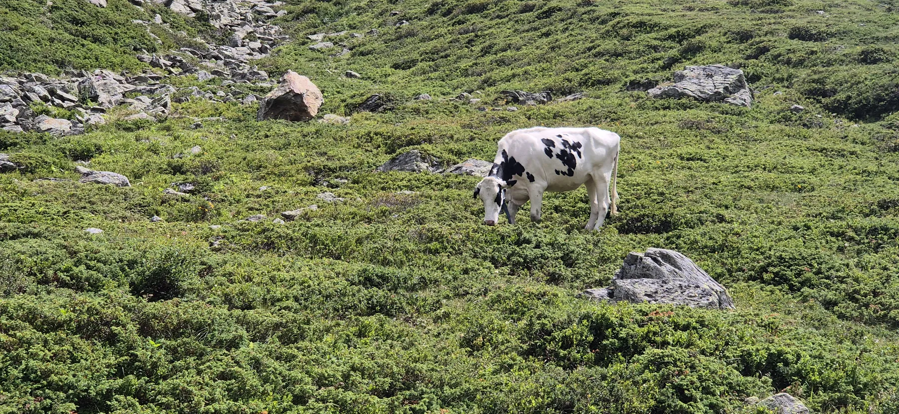{group="tour"}

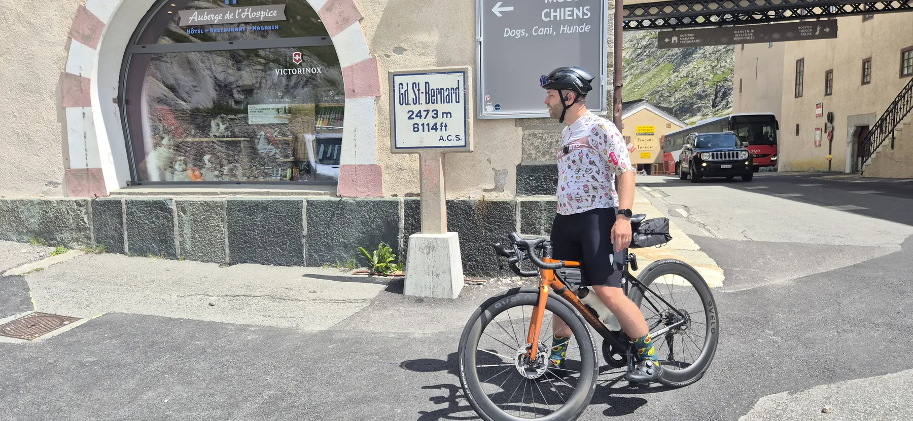{group="tour"}

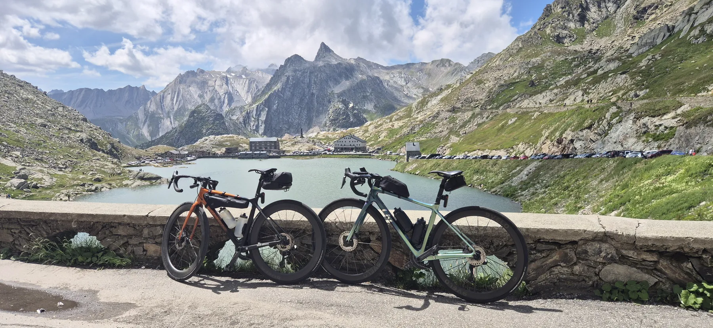{group="tour"}

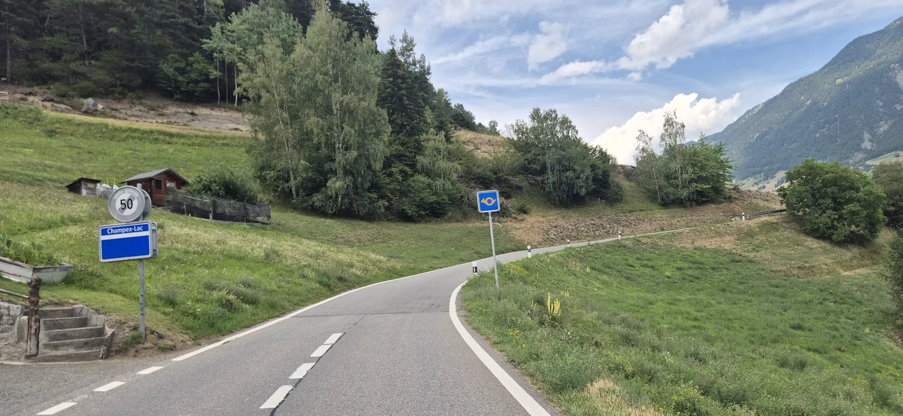{group="tour"}

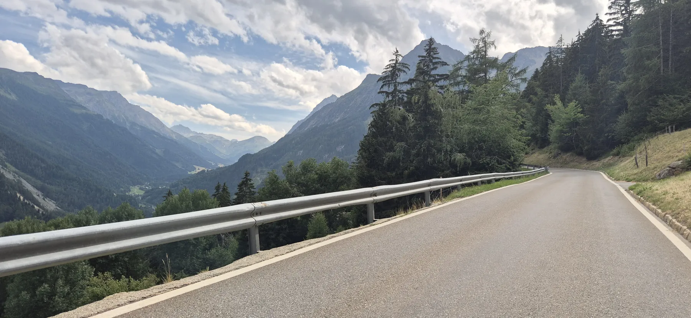{group="tour"}

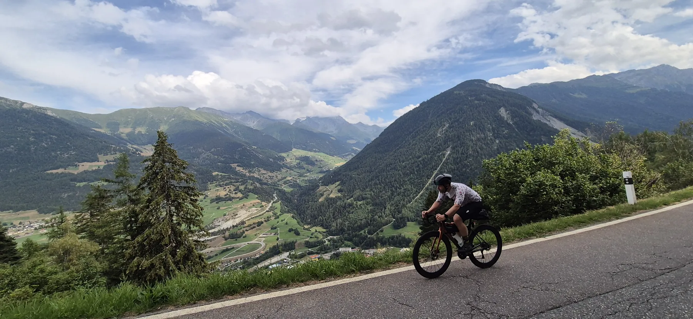{group="tour"}

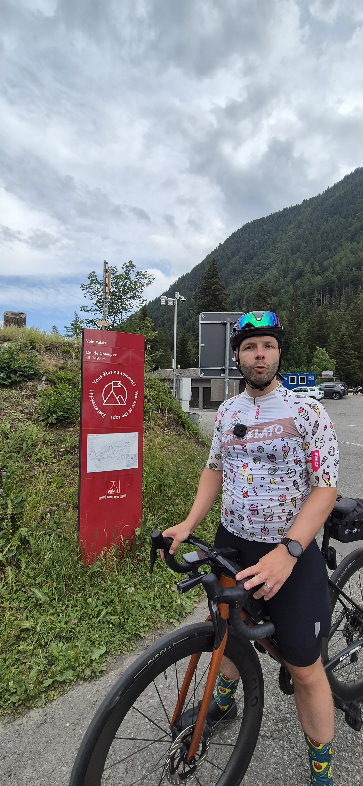{group="tour"}

:::

&nbsp;

::: {.trip-dashboard}

### Sommerurlaub 2026: Stand aktuell

493

Kilometer

15290

Höhenmeter

30h 41min

Fahrzeit

:::
