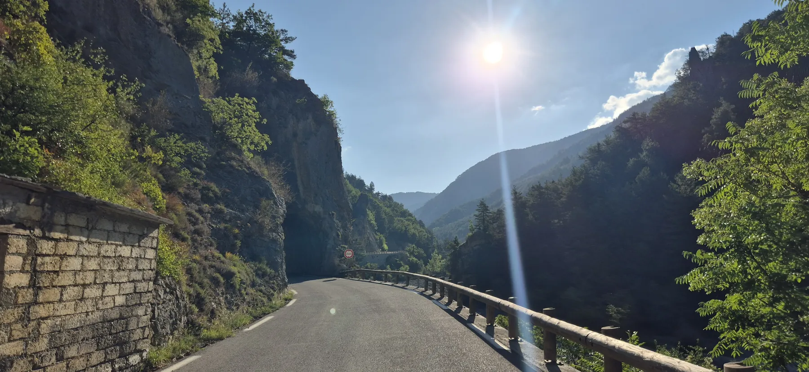
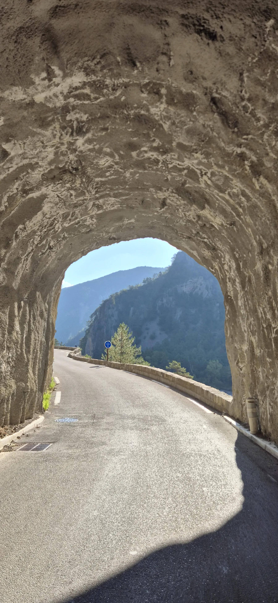
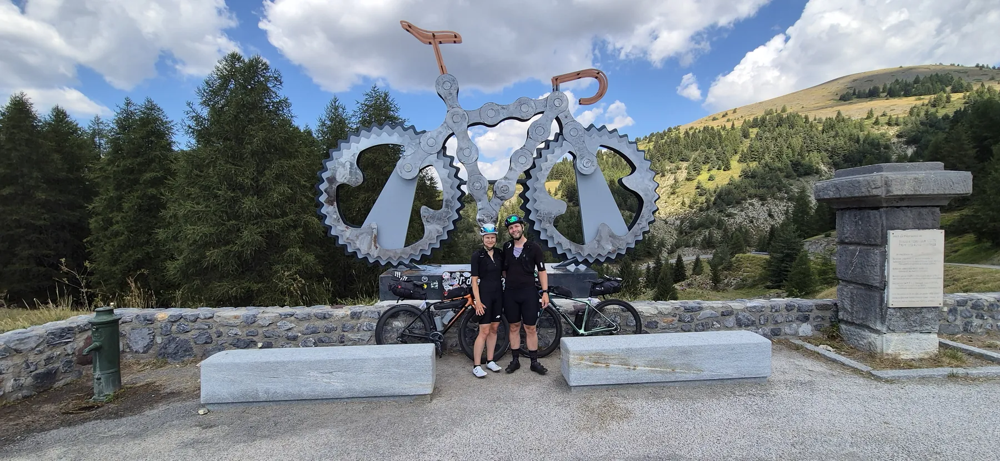
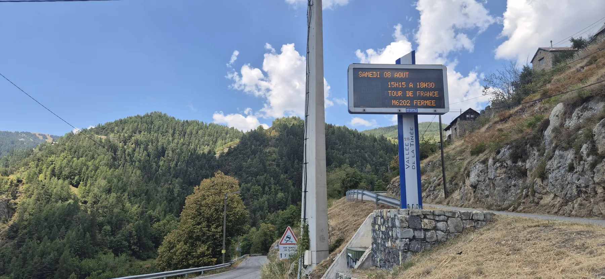
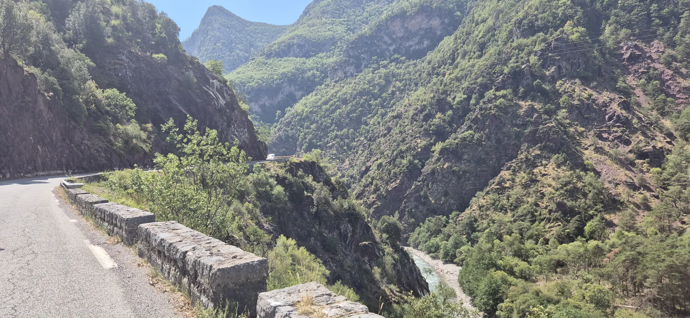
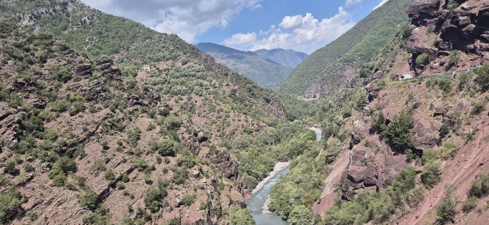
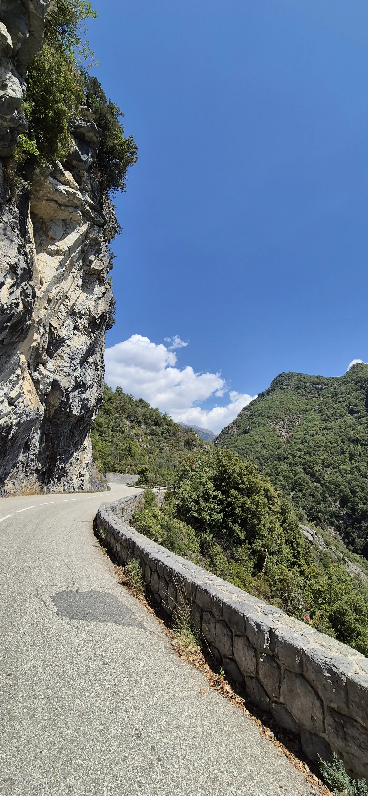
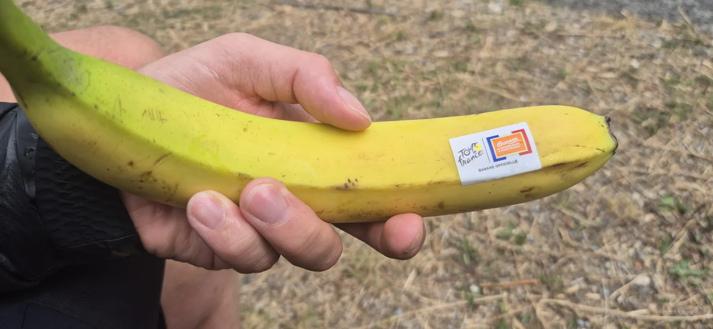
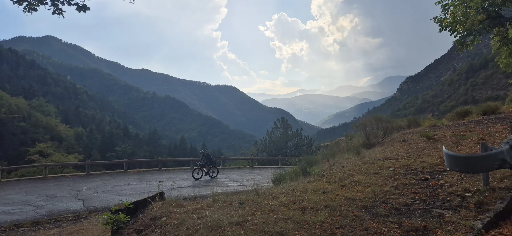
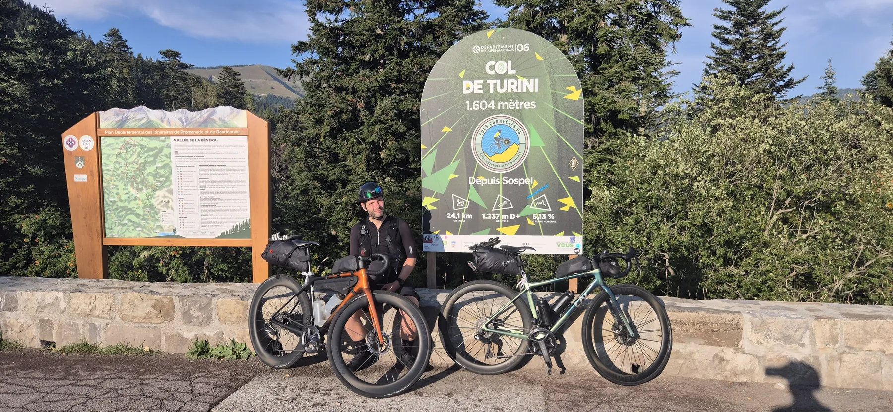

::: {.stats-grid-container}
::: {.stats-grid}

::: {.grid-item}

102.1
Kilometer
:::

::: {.grid-item}

3322
Höhenmeter
:::

::: {.grid-item}

6h 51min
Fahrzeit
:::

::: {.grid-item}

14.9
km/h (62.9 max.)
:::

::: {.grid-item}

103.2
Watt (340 max.)
:::

::: {.grid-item}

131.2
bpm (173.0 max.)
:::

:::
:::

&nbsp;

### Tag der Extreme: Hitze, Regenschauer und Bergankunft am Gruselhotel

Wir haben es geschafft, wir sind in uns sehr bekannten Gefilden angekommen — auf dem Gipfel des Col de Turini auf 1607 m. Damit gab es heute die erste und einzige Bergankunft der Tour de Mariage. 

Der Start in Guillaumes war überaus gelungen: Wir kurbelten zunächst gemütlich nach einem leckeren Frühstück den herrlichen Col de Valberg (1673 m) hinauf und fuhren dann weiter über den etwas bekannteren Col de la Couillole (1678 m), um dann den Col Saint-Martin (1500 m) in Angriff zu nehmen. Spätestens hier lagen die Nerven erstmals blank; die Auffahrt war zwar landschaftlich insbesondere zu Beginn ganz wunderbar, aber auch durchweg sehr exponiert. Und das bedeutete Schwitzen bei ca. 36°C in der prallen Sonne. Die Abfahrt Richtung Col de Turini fühlte sich erst an, als ob man einen riesigen, viel zu heiß eingestellten Fön auf uns gerichtet hätte. Wir waren so happy, als ein paar kleine Wölkchen aufzogen.

Leider hielt die Freude nicht lang an. Machen wir es kurz: Das Ende vom Lied war, dass wir in einem heftigen Regenguss erst 20 Kilometer bergab und dann nochmals klatschnass 15 Kilometer mit netten 1100 Höhenmeter bergauf radeln mussten. Was dann noch zur Perfektion fehlte, ist die Ankunft in einem Hotel, dass buchstäblich auseinanderfällt... Genau. 

Diese Chaos-Tour der Extreme ist nun Geschichte. Wir sind trotzdem stolz, dass wir eisern an unserem Plan festgehalten und durchgezogen haben. Glücklicherweise haben wir ja die ganze Nacht Zeit, uns zu feiern. Denn schlafen dürfte in dieser Bruchbude hier schwierig werden.

Morgen sehen wir dann endlich unser geliebtes Nizza wieder! Aber auch noch nicht auf direktem Wege, sondern über unsere Lieblings-Cols in der Region. Wir sind gespannt — nicht nur, aber auch auf die Zieleinfahrt der Radlerinnen der Tour de France Femmes in Nizza.

&nbsp;

  <canvas id="elevationChart"></canvas>

::: {.gallery}

{group="tour"}

{group="tour"}

{group="tour"}

{group="tour"}

{group="tour"}

{group="tour"}

{group="tour"}

{group="tour"}

{group="tour"}

{group="tour"}

:::

&nbsp;

::: {.trip-dashboard}

### Sommerurlaub 2026: Stand aktuell

1934

Kilometer

56836

Höhenmeter

119h 41min

Fahrzeit

:::
