::: {.stats-grid-container}
::: {.stats-grid}

::: {.grid-item}

91.7
Kilometer
:::

::: {.grid-item}

2724
Höhenmeter
:::

::: {.grid-item}

6h 3min
Fahrzeit
:::

::: {.grid-item}

15.1
km/h (69.2 max.)
:::

::: {.grid-item}

94.3
Watt (240 max.)
:::

::: {.grid-item}

122.9
bpm (173.0 max.)
:::

:::
:::

&nbsp;

### Kärntner Feiertagsradeln

Anlässlich des heutigen Feiertages — Mariä Himmelfahrt — standen zwei als "Österreichs Ikonen" klassifizierte Anstiege auf unserem Programm.

Zu einer sehr humanen Tageszeit starteten wir in Villach und nahmen zunächst die Villacher Alpenstraße in Angriff. Von hier aus bot sich immer wieder ein Panoramablick auf Villach und die dahinterliegenden Bergketten, bis hin zu den Karawanken in Slowenien. Oben auf dem Gipfel genossen wir dann zudem den "3-Seen-Blick": Ossiacher See, Wörthersee und Faaker See.

Anschließend kurbelten wir uns nochmals 1300 Höhenmeter hoch zum Feuerberg — entlang der herrlichen Gerlitzen-Panoramastraße. Weder Asphaltbeschaffenheit noch Steigungsgrade waren für eine gemütliche Spazierfahrt ausgelegt. Dafür waren die Aussichten, insbesondere auf den Ossiacher See, schlichtweg wunderschön. Ein großer Pluspunkt waren die angenehmen Temperaturen beim mehrheitlich durch den Wald führenden Aufstieg von sage und schreibe unter 30°C — dass wir das noch erleben dürfen in unserem Urlaub! Noch kühler hatten es sicher nur die vielen Gleitschirmflieger, die heute zu Hauf über uns hinwegsegelten.

&nbsp;

  <canvas id="elevationChart"></canvas>

::: {.gallery}

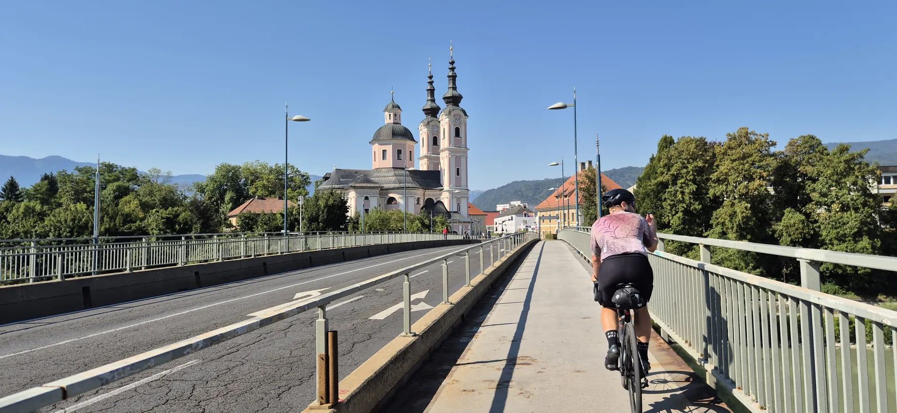{group="tour"}

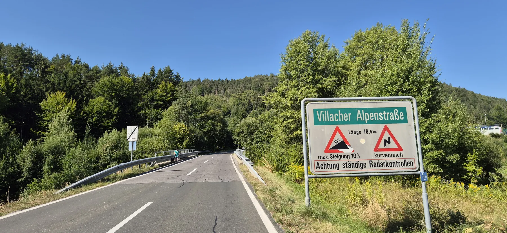{group="tour"}

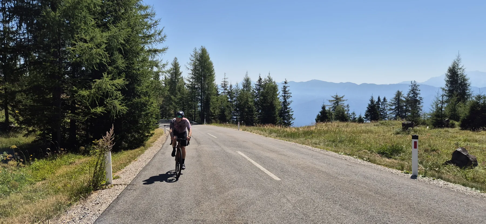{group="tour"}

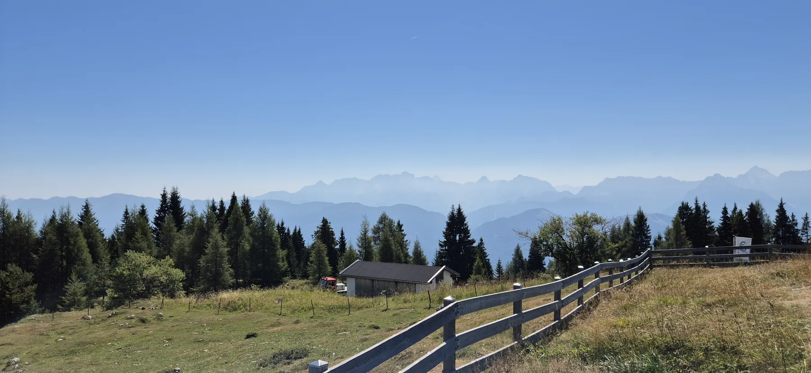{group="tour"}

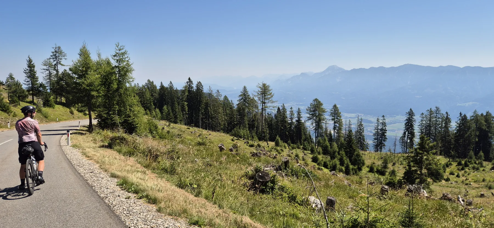{group="tour"}

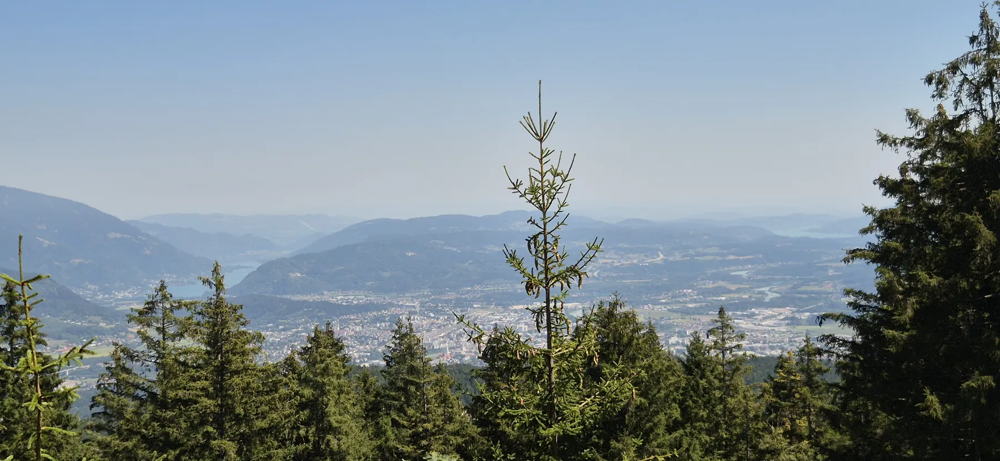{group="tour"}

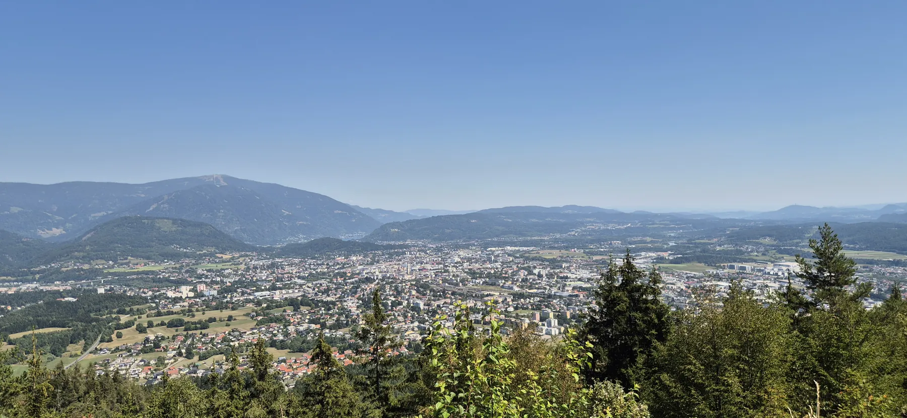{group="tour"}

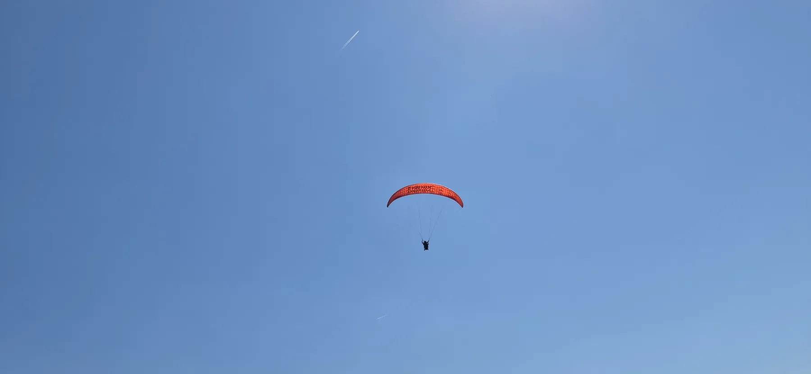{group="tour"}

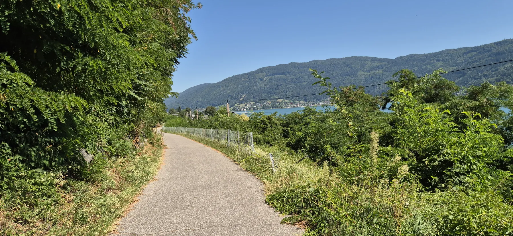{group="tour"}

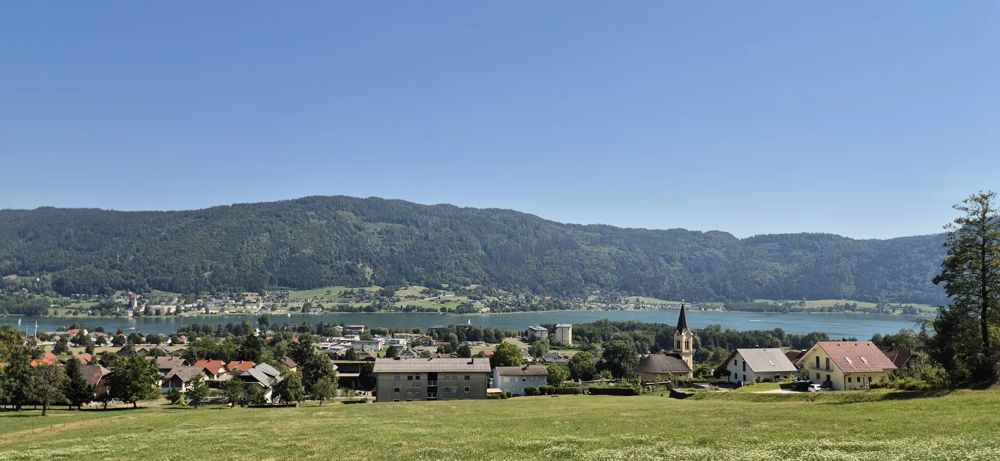{group="tour"}

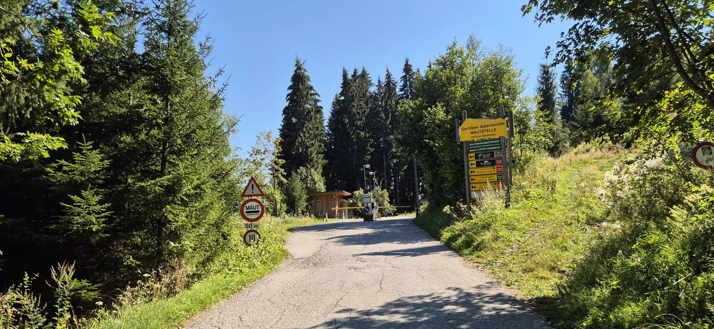{group="tour"}

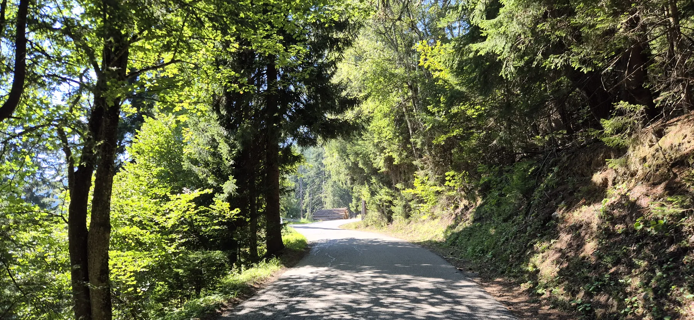{group="tour"}

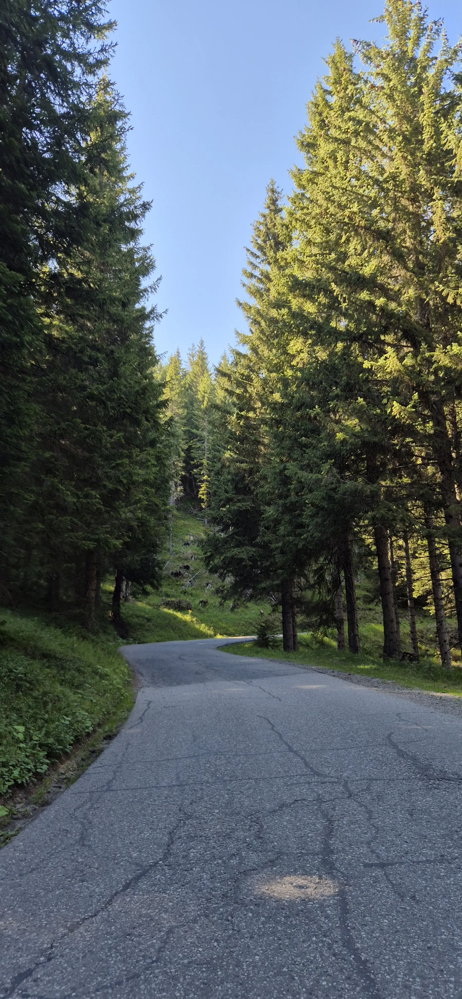{group="tour"}

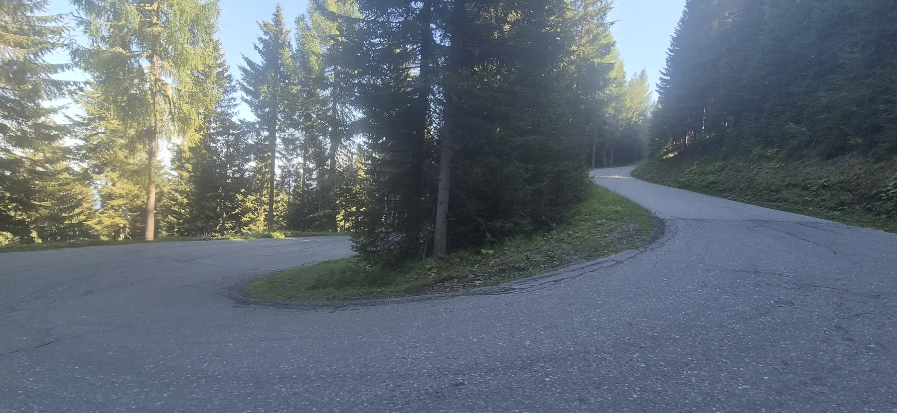{group="tour"}

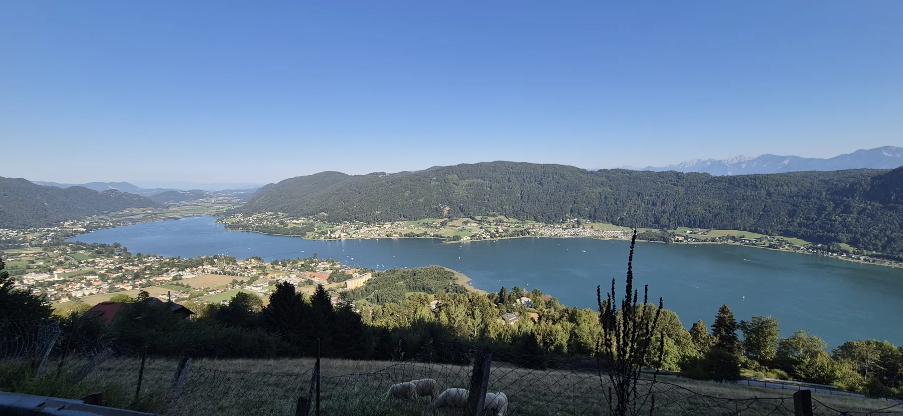{group="tour"}

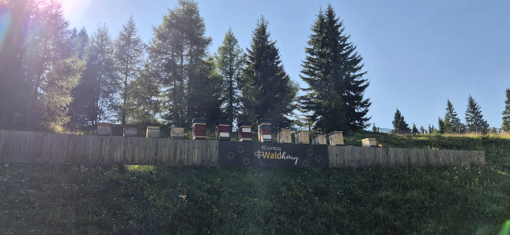{group="tour"}

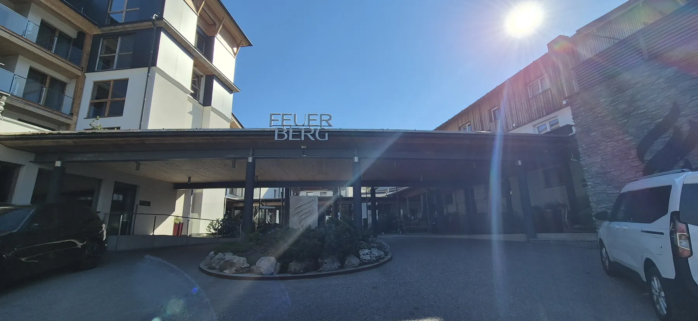{group="tour"}

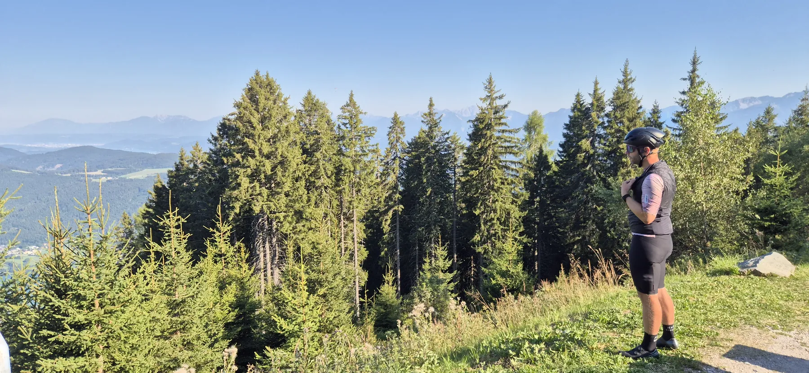{group="tour"}

:::

&nbsp;

::: {.trip-dashboard}

### Sommerurlaub 2026: Stand aktuell

2517

Kilometer

70566

Höhenmeter

152h 59min

Fahrzeit

:::
