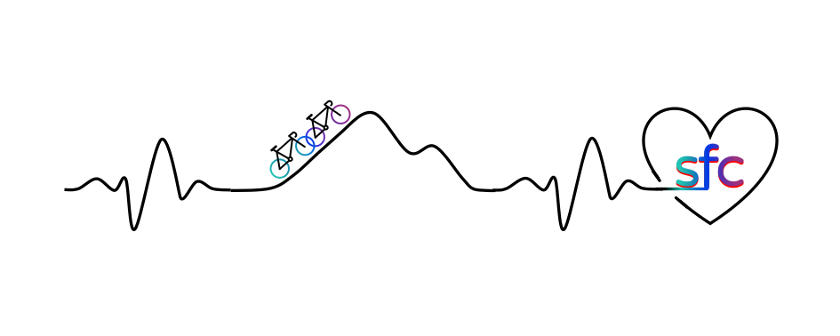

---
about:
  template: jolla
  id: about-block
  image: "img/SoFaCycling.jpg"
  links:
    - icon: strava
      text: Fabis Strava
      href: https://www.strava.com/athletes/18210938
    - icon: strava
      text: Sophies Strava
      href: https://www.strava.com/athletes/35725334
    - icon: github
      text: Github
      href: https://github.com/SoFaCycling
    - icon: envelope
      text: Email
      href: "mailto:sofacycling@gmail.com"  
---


{.hero-banner}


::: {#about-block}
WILLKOMMEN BEI SOFACYCLING!
:::

&nbsp;


Hier sammeln wir unsere Reise-Abenteuer und Erfahrungen rund ums Rennradfahren---um sie für die Ewigkeit festzuhalten.

&nbsp;


```{r}
#| echo: false
#| results: asis

library(fs)

imgs <- dir_ls("assets/carousel", regexp = "\\.(jpg|jpeg|png|webp)$")
imgs <- sample(imgs)

cat('<div id="carouselExampleIndicators" class="carousel slide" data-bs-ride="carousel" data-bs-theme="light" data-bs-interval="2000">')

# indicators
cat('<div class="carousel-indicators">')
for(i in seq_along(imgs)){
  active <- if(i==1) 'class="active" aria-current="true"' else ''
  cat(sprintf(
    '<button type="button" data-bs-target="#carouselExampleIndicators" data-bs-slide-to="%s" %s></button>',
    i-1, active))
}
cat('</div>')

# slides
cat('<div class="carousel-inner">')

for(i in seq_along(imgs)){

  active <- if(i==1) 'active' else ''

  if(i==1){

    img_tag <- sprintf(
      '',
      imgs[i]
    )

  } else {

    img_tag <- sprintf(
      '',
      imgs[i]
    )

  }

  cat(sprintf(
    '<div class="carousel-item %s">%s</div>',
    active, img_tag
  ))
}

cat('</div>')

cat('
<button class="carousel-control-prev" type="button" data-bs-target="#carouselExampleIndicators" data-bs-slide="prev">
<span class="carousel-control-prev-icon"></span>
</button>

<button class="carousel-control-next" type="button" data-bs-target="#carouselExampleIndicators" data-bs-slide="next">
<span class="carousel-control-next-icon"></span>
</button>
</div>
')
```


